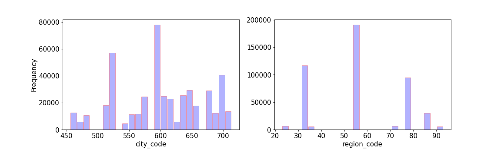
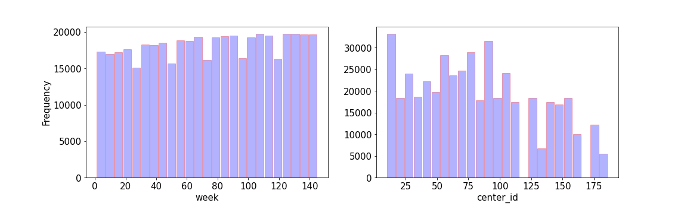

# A/B Testing for Meal Food Delivery 
## Table of contents
* [1. Introduction](#1-introduction)
* [2. Methodology and data](#2-methodology-and-data)
* [3. Exploratory data analysis (EDA)](#3-exploratory-data-analysis-EDA)
* [4. results](#4-results)
    - [4.1. ](#41-)
    - [4.2. ](#42-)
    - [4.3. ](#43-)
* [5. Conclusions](#4-conclusions) 
* [6. Setup](#5-setup)
* [Reference](#reference)

## 1. Introduction

## 2. data, Problem, Methodology
### 2.1 Data

 
Data has gotten from  https://www.kaggle.com/ghoshsaptarshi/av-genpact-hack-dec2018?select=train.csv. This data was part of Analytics Vidhya and Genpact's Machine Learning Hackathon work during Dec 15 2018 00:00 GMT+0530 to Dec 16 2018 23:59 GMT+0530.  
Based on the data, there is a meal delivery company in multiple cities for sending meal orders to its customers. Collections of data are done weekly. The dataset includes three dataframes: 
fulfilmentcenterinfo.csv: 5 columns information contain 'center_id', 'city_code', 'region_code', 'center_type', and 'op_area' for each fulfillment center,  
meal_info.csv: three columns information contain 'meal_id', 'category', and 'cuisine' for each meal being served,  
order_via_price.csv: 9 columns information contains 'id', 'week', 'center_id', 'meal_id', 'checkout_price', 'base_price', 'emailer_for_promotion', 'homepage_featured', and 'num_orders' for orders and checkout price. 
As a result of a combination of three tables, there is a new table with 15 columns. In table 1 you can see all columns with a brief explanation of them. 

<table> {float:left}
    <caption><b>Table 1.</b> Introducing features and their Feature Explanation
  </caption> 
    <tr align="left"> <th>Fearture</th><th>Feature Explanation</th> </tr> 
    <td align="left">Id (AA)</td><td align="left">Unique ID</td></tr>
    <td align="left">week</td><td align="left">Week Number</td></tr>
    <td align="left">center_id</td><td align="left">Unique ID for fulfillment center</td></tr>
    <td align="left">meal_id</td><td align="left" >Unique ID for Meal</td></tr>
    <td align="left">checkout_price</td><td align="left">Final price including discount, taxes and delivery charges</td></tr>
    <td align="left">base_price</td><td align="left">Base price of the meal</td></tr>
    <td align="left">emailer_for_promotion</td><td align="left">Emailer sent for promotion of meal</td></tr>
    <td align="left">homepage_featured</td><td align="left">Meal featured at homepage</td></tr>
    <td align="left">num_orders</td><td align="left">Orders Count</td></tr>
    <td align="left">category</td><td align="left">Type of meal (beverages/snacks/soup/...)</td></tr>
    <td align="left">cuisine</td><td align="left">Meal cuisine (Indian/Italian/…)</td></tr>
    <td align="left">city_code</td><td align="left">Unique code for city</td></tr>
    <td align="left">region_code</td><td align="left">Unique code for region</td></tr>
    <td align="left">center_type</td><td align="left">Anonymized center type</td></tr>
    <td align="left">op_area</td><td align="left">Area of operation (in km^2)</td></tr>  
</table>

### 2.2  Problem

The preparation of raw materials is done weekly because the most  raw material is perishable. This is the biggest problem for the company. In order to solve this problem, first of all the procurement planning is of the most extreme importance. Secondly, the centers can also help to forecast accurate demands. The aim of this work is following information for evaluation which factors help to balance between supply and demand and increase number orders and sales. This evaluation is done by A/B testing approach based on data from week 1 to 145, meal features such as category, cuisine, checkout price and number orders, and information for fulfillment centers like center area and city information.
 

### 2.3 Methodology

For this work, A/B testing is a way to compare two versions of categories, cuisine, meal featured at homepage, emailer sent for promotion of meal and anonymized center type to figure out which performs better. While this method can not able to predict checkout price or number orders, the method is the simplest forms of a randomized controlled experiment. This testing method has risen in popularity over the last couple of decades as companies have realized that the online environment is well-suited to help managers, especially marketers, answer questions like, “What is most likely to make people click? Or buy our product? Or register with our site?”. It’s now used to evaluate everything from website design to online offers to headlines to product descriptions. The test works by showing two sets of users (assigned at random when they visit the site) different versions of a product or site and then determining which influenced your success metric the most. While it’s an often-used method, there are several mistakes that managers make when doing A/B testing: reacting to early data without letting the test run its full course; looking at too many metrics instead of focusing on the ones they most care about; and not doing enough retesting to be sure they didn’t get false positive results.
 

## 3. Exploratory data analysis (EDA)

 
 In this section we perform some EDA to gain some insights about the data.  
 

      
 

    
    
     
    
    
    
    

  
<b>Figure 3.</b> TAT histogram of the four most popular airlines in 2015 in the USA. It is clear from these plots that there are two distincts classes for each airline. This give us a clue to classify TAT into two classes. 

    
     
    
    
    
    

  
<b>Figure 3.</b> TAT histogram of the four most popular airlines in 2015 in the USA. It is clear from these plots that there are two distincts classes for each airline. This give us a clue to classify TAT into two classes. 

    
     
    
    
    
    
    

  

<b>Figure 3.</b> TAT histogram of the four most popular airlines in 2015 in the USA. It is clear from these plots that there are two distincts classes for each airline. This give us a clue to classify TAT into two classes. 

    
     
    
    
    
    
    
    
    
    

  

<b>Figure 3.</b> TAT histogram of the four most popular airlines in 2015 in the USA. It is clear from these plots that there are two distincts classes for each airline. This give us a clue to classify TAT into two classes. 

    
     
    
    

  

<b>Figure 3.</b> TAT histogram of the four most popular airlines in 2015 in the USA. It is clear from these plots that there are two distincts classes for each airline. This give us a clue to classify TAT into two classes. 

    
     
    
    
    

  

<b>Figure 3.</b> TAT histogram of the four most popular airlines in 2015 in the USA. It is clear from these plots that there are two distincts classes for each airline. This give us a clue to classify TAT into two classes. 

## 4. results
### 4.1. 
### 4.2.
### 4.3. 
## 5. Conclusions

## 6. Setup
There are two folders in the repository: 
1- notebooks: contain all Jupyter notebook files  
2- src : contain all .py files  
All codes are written in Python 3.6.9  
To run this project you should run "main_code.py" in "src" folder or "main_code.ipynp" in "notebooks" folder. In "main_code.py" the following modules are imported with their tasks are conveyed in their names: 

* step_1_cleaning_data  
* step_2_convert_timecolumns_to_standard_time         
* step_3_choose_features_and_define_target  
* step_4_EDA_1  
* step_4_EDA_2 
* step_4_EDA_of_AA_OO_DL_WN_3   
* step_5_EDA_and_separate_airline_data 
* step_6_apply_ML_models_OO_airlines
 - step_6_1_divide_data_into_seen_and_unseen_files   
 - step_6_2_predict_categories_of_target  
 - step_6_3_predict_seen_target 
 - step_6_4_predic_unseen_target 
* step_6_apply_ML_models_AA_airlines 
 - step_6_1_divide_data_into_seen_and_unseen_files   
 - step_6_2_predict_categories_of_target  
 - step_6_3_predict_seen_target 
 - step_6_4_predic_unseen_target 
* step_6_apply_ML_models_DL_airlines
 - step_6_1_divide_data_into_seen_and_unseen_files   
 - step_6_2_predict_categories_of_target  
 - step_6_3_predict_seen_target 
 - step_6_4_predic_unseen_target 
* step_6_apply_ML_models_WN_airlines
 - step_6_1_divide_data_into_seen_and_unseen_files   
 - step_6_2_predict_categories_of_target  
 - step_6_3_predict_seen_target 
 - step_6_4_predic_unseen_target 

## Reference
[1] E. Mazareanu,“Global air traffic - number of flights 2004-2021”, Dec 2, 2020. (https://www.statista.com/statistics/564769/airline-industry-number-of-flights/#statisticContainer)  
[2] M. A. Makhloof, M. E. Waheed, U. A. Badawi, "Real-time aircraft turnaround operations manager", Production Planning & Control 25:1, pages 2-25, 2014. 
[3] https://www.azcentral.com  
[4] https://www.kaggle.com/usdot/flight-delays  
[5] https://www.transtats.bts.gov/OT_Delay/OT_DelayCause1.asp  
