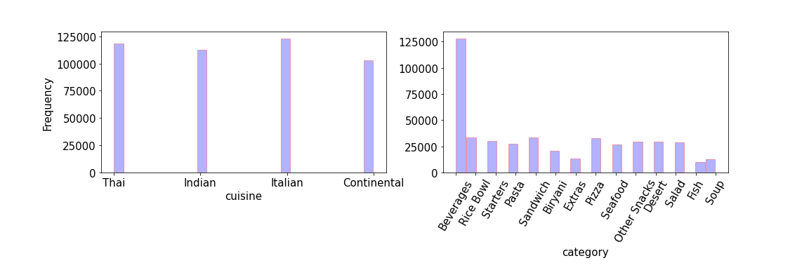
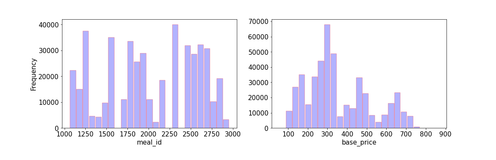
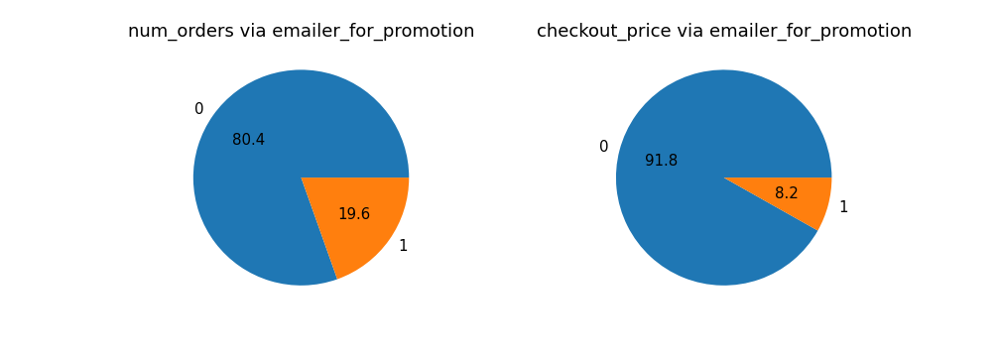
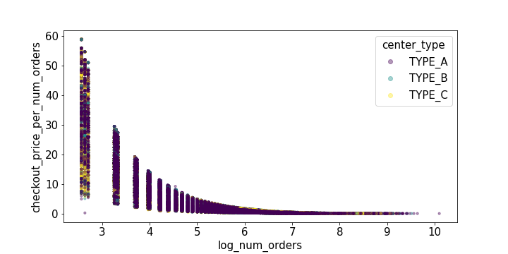
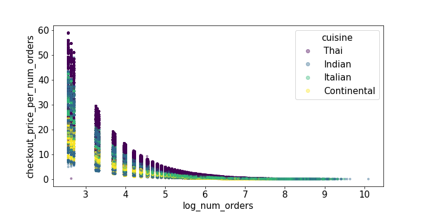

# Meal Food Delivery 
## Table of contents
* [1. Introduction](#1-introduction)
* [2. Methodology and data](#2-methodology-and-data)
* [3. Exploratory data analysis (EDA)](#3-exploratory-data-analysis-EDA)
* [4. results](#4-results)
    - [4.1. ](#41-)
    - [4.2. ](#42-)
    - [4.3. ](#43-)
* [5. Conclusions](#4-conclusions) 
* [6. Setup](#5-setup)
* [Reference](#reference)

## 1. Introduction

## 2. Methodology and data

## 3. Exploratory data analysis (EDA)

 
 In this section we perform some EDA to gain some insights about the data.  
 

      
 

    
    
     
    
    
    
    

  
<b>Figure 3.</b> TAT histogram of the four most popular airlines in 2015 in the USA. It is clear from these plots that there are two distincts classes for each airline. This give us a clue to classify TAT into two classes. 

    
     
    
    
    
    

  
<b>Figure 3.</b> TAT histogram of the four most popular airlines in 2015 in the USA. It is clear from these plots that there are two distincts classes for each airline. This give us a clue to classify TAT into two classes. 

    
     
    
    
    
    
    

  

<b>Figure 3.</b> TAT histogram of the four most popular airlines in 2015 in the USA. It is clear from these plots that there are two distincts classes for each airline. This give us a clue to classify TAT into two classes. 

    
     
    
    
    
    
    
    
    
    

  

<b>Figure 3.</b> TAT histogram of the four most popular airlines in 2015 in the USA. It is clear from these plots that there are two distincts classes for each airline. This give us a clue to classify TAT into two classes. 

    
     
    
    

  

<b>Figure 3.</b> TAT histogram of the four most popular airlines in 2015 in the USA. It is clear from these plots that there are two distincts classes for each airline. This give us a clue to classify TAT into two classes. 

    
     
    
    
    

  

<b>Figure 3.</b> TAT histogram of the four most popular airlines in 2015 in the USA. It is clear from these plots that there are two distincts classes for each airline. This give us a clue to classify TAT into two classes. 

## 4. results
### 4.1. 
### 4.2.
### 4.3. 
## 5. Conclusions

## 6. Setup
There are two folders in the repository: 
1- notebooks: contain all Jupyter notebook files  
2- src : contain all .py files  
All codes are written in Python 3.6.9  
To run this project you should run "main_code.py" in "src" folder or "main_code.ipynp" in "notebooks" folder. In "main_code.py" the following modules are imported with their tasks are conveyed in their names: 

* step_1_cleaning_data  
* step_2_convert_timecolumns_to_standard_time         
* step_3_choose_features_and_define_target  
* step_4_EDA_1  
* step_4_EDA_2 
* step_4_EDA_of_AA_OO_DL_WN_3   
* step_5_EDA_and_separate_airline_data 
* step_6_apply_ML_models_OO_airlines
 - step_6_1_divide_data_into_seen_and_unseen_files   
 - step_6_2_predict_categories_of_target  
 - step_6_3_predict_seen_target 
 - step_6_4_predic_unseen_target 
* step_6_apply_ML_models_AA_airlines 
 - step_6_1_divide_data_into_seen_and_unseen_files   
 - step_6_2_predict_categories_of_target  
 - step_6_3_predict_seen_target 
 - step_6_4_predic_unseen_target 
* step_6_apply_ML_models_DL_airlines
 - step_6_1_divide_data_into_seen_and_unseen_files   
 - step_6_2_predict_categories_of_target  
 - step_6_3_predict_seen_target 
 - step_6_4_predic_unseen_target 
* step_6_apply_ML_models_WN_airlines
 - step_6_1_divide_data_into_seen_and_unseen_files   
 - step_6_2_predict_categories_of_target  
 - step_6_3_predict_seen_target 
 - step_6_4_predic_unseen_target 

## Reference
[1] E. Mazareanu,“Global air traffic - number of flights 2004-2021”, Dec 2, 2020. (https://www.statista.com/statistics/564769/airline-industry-number-of-flights/#statisticContainer)  
[2] M. A. Makhloof, M. E. Waheed, U. A. Badawi, "Real-time aircraft turnaround operations manager", Production Planning & Control 25:1, pages 2-25, 2014. 
[3] https://www.azcentral.com  
[4] https://www.kaggle.com/usdot/flight-delays  
[5] https://www.transtats.bts.gov/OT_Delay/OT_DelayCause1.asp  
