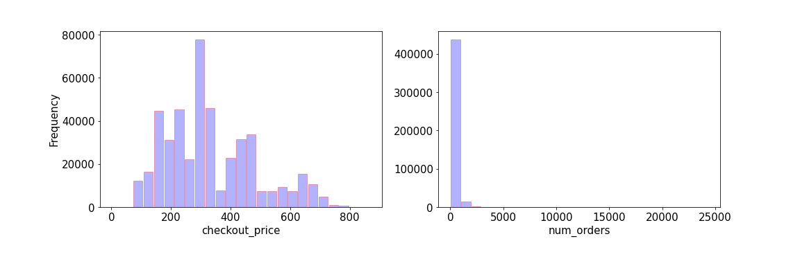
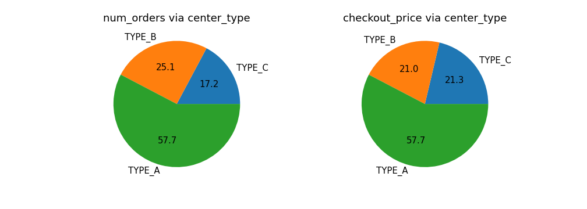
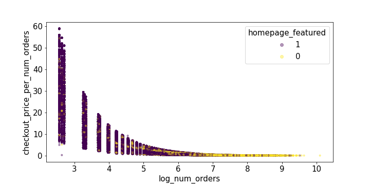

# A/B Testing for Meal Food Delivery 
## Table of contents
* [1. Introduction](#1-introduction)
* [2. Data and Methodology](#2-data-and-methodology)
   - [2.1. Data](#21-data)
   - [2.2. Methodology](#22-methodology)
* [3. Exploratory data analysis (EDA)](#3-exploratory-data-analysis-eda)
* [4. results](#4-results)
    - [4.1. A/B Testing Based on Meal Cuisine](#41-ab-testing-based-on-meal-cuisine)
    - [4.2. A/B Testing Based on Category of Meal](#42-ab-testing-based-on-category-of-meal)
    - [4.3. A/B Testing Based on Meal Featured at Homepage](#43-ab-testing-based-on-meal-featured-at-homepage)
    - [4.4. A/B Testing Based on Emailer Sent for Promotion of Meal](#44-ab-testing-based-on-emailer-sent-for-promotion-of-meal)
    - [4.5. A/B Testing Based on Anonymized Center Type](#45-ab-testing-based-on-anonymized-center-type)
    - [4.6. A/B Testing Based on Week Number](#46-ab-testing-based-on-week-number)
* [5. Conclusions](#4-conclusions) 
* [6. Setup](#5-setup)

## 1. Introduction

The United States Food Delivery Market generated $18.5 billion in 2020. It is estimated that the market will grow rapidly and reach $33.7 billion by 2026.
One of the biggest challenges for this market is the preparation of raw materials because most raw materials are perishable. To solve this problem, companies use procurement planning and need to forecast accurate demands. In this work instead of building models to predict the demand, the whole market was studied to understand if there has been any significant change in order numbers, prices and sales over time using the hypothesis testing approach. An extensive investigation of the data was performed by considering features such as week, meal features such as category, cuisine, checkout price and number of orders, and information for fulfillment centers like center area and city information. 
Interestingly, it is observed that different hypothesis testing methods may give different results as to whether or not reject the null hypothesis. Therefore, one should be careful about the assumptions of each method and then draw a conclusion to make sure that the assumptions are met. This might be more crucial and give misleading results if someone uses a softwares to perform hypothesis testing without understanding how the software performs the test. Also it was shown that by changing the threshold of variables one could find a regime where null hypothesis is rejected although this rejection is an artifact of choosing a specific range of threshold. 

    

<b>Figure 1.</b> A sample of food boxes for delevity from https://www.oxocustomboxes.com/product/custom-chinese-food-boxes-2 .

## 2. data and Methodology
### 2.1 Data

 
The source of the data is from Kaggle 
(https://www.kaggle.com/ghoshsaptarshi/av-genpact-hack-dec2018?select=train.csv). This data was part of Analytics Vidhya and Genpact's Machine Learning Hackathon and the goal was to predict the future demand. Based on the data, there is a meal delivery company in multiple cities which delivers meal orders from its centers to its customers. Collections of data are done weekly. The dataset includes three dataframes: 
- fulfilmentcenterinfo.csv: 5 columns information contain 'center_id', 'city_code', 'region_code', 'center_type', and 'op_area' for each fulfillment center, 
- meal_info.csv: three columns information contain 'meal_id', 'category', and 'cuisine' for each meal being served, 
- order_via_price.csv: 9 columns information contains 'id', 'week', 'center_id', 'meal_id', 'checkout_price', 'base_price', 'emailer_for_promotion', 'homepage_featured', and 'num_orders' for orders and checkout price. 
As a result of a combination of three tables, there is a new table with 15 columns. In table 1 you can see all columns with a brief explanation of them.
 

<table> 
    <caption><b>Table 1.</b> Introducing features and their Feature Explanation
  </caption> 
    <tr align="left"> <th>Fearture</th><th>Feature Explanation</th> </tr> 
    <td align="left">Id (AA)</td><td align="left">Unique ID</td></tr>
    <td align="left">week</td><td align="left">Week Number</td></tr>
    <td align="left">center_id</td><td align="left">Unique ID for fulfillment center</td></tr>
    <td align="left">meal_id</td><td align="left" >Unique ID for Meal</td></tr>
    <td align="left">checkout_price</td><td align="left">Final price including discount, taxes and delivery charges</td></tr>
    <td align="left">base_price</td><td align="left">Base price of the meal</td></tr>
    <td align="left">emailer_for_promotion</td><td align="left">Emailer sent for promotion of meal</td></tr>
    <td align="left">homepage_featured</td><td align="left">Meal featured at homepage</td></tr>
    <td align="left">num_orders</td><td align="left">Orders Count</td></tr>
    <td align="left">category</td><td align="left">Type of meal (beverages/snacks/soup/...)</td></tr>
    <td align="left">cuisine</td><td align="left">Meal cuisine (Indian/Italian/…)</td></tr>
    <td align="left">city_code</td><td align="left">Unique code for city</td></tr>
    <td align="left">region_code</td><td align="left">Unique code for region</td></tr>
    <td align="left">center_type</td><td align="left">Anonymized center type</td></tr>
    <td align="left">op_area</td><td align="left">Area of operation (in km^2)</td></tr>  
</table>

### 2.2 Methodology

For this work, two sample hypothesis testing (A/B testing) was used to find out if there is a significant change in two versions of categories, cuisine, meal featured at homepage, emailer sent for promotion of meal and anonymized center type. As it was mentioned this method is not able to predict checkout price or number orders and that was not the goal of this investigation. This method is the simplest form of a randomized controlled experiment because one  can control the factors which they know about but maybe there are other randomized factors that they do not know about. This testing method can help the food delivery company to get a sense of change in the market based on features in table 1, especially number of orders and sales. For example, the goal was to answer the question of if there is a significant difference in sales or number of orders between Italian and Thai cuisines. For this example the following steps were taken to do the two sample hypothesis testing (A/B testing): 
Null hypothesis: the average number of orders for Italian cuisine is the same as the average number of orders for Thai cuisine.
Alternative hypothesis: the average number of orders are not the same. 
- set significant level (α) : α=0.05. 
- Calculate p-value: two sample t-test (Welch t test) and two sample u-test (Mann Whitney) methods. 
- Conclusion: If p_value is less than α: reject the null hypothesis; otherwise fail to reject null hypothesis. 
A similar procedure was followed to do all the other tests. 
 

## 3. Exploratory data analysis (EDA)

  
In this section some EDA is performed to gain some insights about the data. The figure 2 shows histograms of features. Based on this figure, type_A has the highest level in center_type feature. The distribution of op_eara shows the maximum level is at the area of operation in 4 km^2. Interestingly, the checkout price has a narrow range between $100 to $800 with more or less a normal distribution. In contrast, num_orders is in a wide range from 0 to 25000 which follow a half normal distribution. There are four types of cuisines: Thai, Indian, Italian (with the highest frequency) and Continental (with the lowest frequency). Among the meals, beverages have a very high frequency. Unlike beverages, other types of meals have approximately the same frequency. Emailer_for_promotion and homepage_featured have two types with similar distributions. For feature week, there is a regular alternative behavior but you should be careful because this figure is just the histogram of week in the data and does not show the number of orders in each week.  
 

      
 

    
    
     
    
    
    
    

  
<b>Figure 2.</b> Histograms of features of meal food delivery which is mentioned in table 1.

 
 The figure 3 shows pie plots of features versus number orders and checkout price. Based on this figure, the most percentage of number orders (popularity) are orders of Beverages and rice bowl and sandwich among categories and the most expensive categories are beverages, pizza and seafood. Number orders and checkout price via center_type behave similarly. Comparison number orders and checkout price based on cuisines give different information. However Italian cuisine has the highest order but Continental cuisine is the most expensive and it makes sense Continental cuisine has the lowest order. For emailer_for promotion, homepage_featured and region_code have the same correlation via number orders and checkout price. 
 

    
     
    
    
    
    

  
<b>Figure 3.</b> Pie plots of features of meal food delivery which is mentioned in table 1.

 
 The figure 4 shows bar plots of features versus number orders and checkout price. The EDA of this figure is like the figure 3. The figure 5 shows scatter plots of features versus number orders and checkout price. The EDA of this figure does not show specific things. 
 

    
     
    
    
    
    
    

  

<b>Figure 4.</b> bar plots of features of meal food delivery which is mentioned in table 1.

    
     
    
    
    
    
    
    
    
    

  

<b>Figure 5.</b> Scatter plots of features of meal food delivery which is mentioned in table 1.

 
 In the figure 6, average checkout_price goes up very slowly via week while the average number of orders has fluctuations around 300. There is interesting behaviour in the plot of average emailer_for_promotion. This plot shows sending a promotion email is alternative but it doesn't have a direct effect on increasing number orders. It can be a good consideration that  emailer_for_promotion has an effect on sales based on A/B testing. It can be defined for this problem for homepage_featured as well.   
 

    
     
    
    

  

<b>Figure 6.</b> Illustration of mean and standard deviation (std) of checkout_price, emailer_for_promotion, homepage_featured and num_orders via week.  

 
In the figure 7, total checkout_price and total checkout price per number orders go up via week while total number of orders is constant approximately. It makes sense that the price increases over time due to inflammation.  
 

    
     
    
    
    

  

<b>Figure 7.</b> Illustration of mean and standard deviation (std) of total checkout rpice in each week (sum_over_checkout_price), sum_over_emailer_for_promotion, sum_over_homepage_featured, sun_over_num_orders and total checkout price per number orders (sum_over_price_per_order) via week. 

## 4. results
There are some hypotheses and they will be evaluated based on A/B testing. Significant level (α) is set 0.05.
### 4.1. A/B Testing Based on Meal Cuisine
There are four cuisines and there is a question: do these cuisines have the same average checkout price and average number of orders?
For example  
Null hypothesis: checkout price/ number orders of Italian cuisine is the same as the checkout price Thai cuisine! 
Alternative: The checkout price/ number orders of Italian and Thai cuisines is not the same! 
Calculate p-value  
if p-value <0.05: reject null hypothesis  
otherwise: can not reject null hypothesis  
Based on table 2 and 3, the null hypothesis can be rejected. 

    

 

<b>Table 2.</b> There are two samples: A and B based on which cuisine. pval_ttest and pval_utest show the amount of p_value from two sample t-test (Welch t test) and two sample u-test (Mann Whitney) methods respectively. mean_checkout_price_A, mean_checkout_price_B, n_A and n_B show average checkout price and number of samples A and B. Two last columns are answers to the question that the Null hypothesis can be rejected or not. Based on this table for all cuisine it is not a correct hypothesis that the average checkout price is independent of cuisions. 

    

<b>Table 3.</b> There are two samples: A and B based on which cuisine. pval_ttest and pval_utest show the amount of p_value from two sample t-test (Welch t test) and two sample u-test (Mann Whitney) methods respectively. mean_num_orders_A, mean_num_orders_B, n_A and n_B show average number orders and number of samples A and B. Two last columns are answers to the question that the Null hypothesis can be rejected or not. Based on this table for all cuisine it is not a correct hypothesis that the average number orders is independent of cuisions. 

### 4.2. A/B Testing Based on Category of Meal
There are fourteen categories and there is a question: do these categories have the same average checkout price and average number of orders?
For example  
Null hypothesis: checkout price/ number orders of Beverages is the same as the checkout price/ number orders of Rice Bowl! 
Alternative: The checkout price/ number orders of Beverages and Rice Bowl is not the same! 
Based on table 4 and 5, the null hypothesis can be rejected for all categories. 

    

 

<b>Table 4.</b> There are two samples: A and B based on which cuisine. pval_ttest and pval_utest show the amount of p_value from two sample t-test (Welch t test) and two sample u-test (Mann Whitney) methods respectively. mean_checkout_price_A, mean_checkout_price_B, n_A and n_B show average checkout price and number of samples A and B. Two last columns are answers to the question that the Null hypothesis can be rejected or not. Based on this table for all cuisine it is not a correct hypothesis that the average chechout price is independent of categories. 

    

<b>Table 5.</b> There are two samples: A and B based on which cuisine. pval_ttest and pval_utest show the amount of p_value from two sample t-test (Welch t test) and two sample u-test (Mann Whitney) methods respectively. mean_num_orders_A, mean_num_orders_B, n_A and n_B show average number orders and number of samples A and B. Two last columns are answers to the question that the Null hypothesis can be rejected or not. Based on this table for all cuisine it is not a correct hypothesis that the number orders is independent of categories. 

### 4.3. A/B Testing Based on Meal Featured at Homepage
There are two options for meals featured at homepage and there is a question: do these options have the same average checkout price and average number of orders? 
Null hypothesis: checkout price/ number orders of both meals featured at homepage are the same! 
Alternative: The checkout price/ number orders of both meals featured at the homepage are not the same! 
Based on table 6 and 7, the null hypothesis can be rejected for both options of meal featured at homepage. 

    

 

<b>Table 6.</b> There are two samples: A and B based on which option of meal featured at homepage. pval_ttest and pval_utest show the amount of p_value from two sample t-test (Welch t test) and two sample u-test (Mann Whitney) methods respectively. mean_checkout_price_A, mean_checkout_price_B, n_A and n_B show average checkout price and number of samples A and B. Two last columns are answers to the question that the Null hypothesis can be rejected or not. Based on this table for both options of meal featured at homepage it is not a correct hypothesis that the average checkout price is independent of meal featured at homepage. 

    

<b>Table 7.</b> There are two samples: A and B based on which cuisine. pval_ttest and pval_utest show the amount of p_value from two sample t-test (Welch t test) and two sample u-test (Mann Whitney) methods respectively. mean_num_orders_A, mean_num_orders_B, n_A and n_B show average number orders and number of samples A and B. Two last columns are answers to the question that the Null hypothesis can be rejected or not. Based on this table for both options of meal featured at homepage it is not a correct hypothesis that the number orders is independent of meal featured at homepage. 

### 4.4. A/B Testing Based on Emailer Sent for Promotion of Meal
There are two options for emailer sent for promotion of meal and there is a question: do these options have the same average checkout price and average number of orders? 
Null hypothesis: checkout price/ number orders of both options of emailer sent for promotion of meal are the same! 
Alternative: The checkout price/ number orders of both options of emailer sent for promotion of meale are not the same! 
Based on table 8 and 9, the null hypothesis can be rejected for both options of emailer sent for promotion of meal. 

    

 

<b>Table 8.</b> There are two samples: A and B based on which option of emailer sent for promotion of meal. pval_ttest and pval_utest show the amount of p_value from two sample t-test (Welch t test) and two sample u-test (Mann Whitney) methods respectively. mean_checkout_price_A, mean_checkout_price_B, n_A and n_B show average checkout price and number of samples A and B. Two last columns are answers to the question that the Null hypothesis can be rejected or not. Based on this table for both options of emailer sent for promotion of meal it is not a correct hypothesis that the average checkout price is independent of emailer sent for promotion of meal. 

    

<b>Table 9.</b> There are two samples: A and B based on which cuisine. pval_ttest and pval_utest show the amount of p_value from two sample t-test (Welch t test) and two sample u-test (Mann Whitney) methods respectively. mean_num_orders_A, mean_num_orders_B, n_A and n_B show average number orders and number of samples A and B. Two last columns are answers to the question that the Null hypothesis can be rejected or not. Based on this table for both options of emailer sent for promotion of meal it is not a correct hypothesis that the number orders is independent of emailer sent for promotion of meal. 

### 4.5. A/B Testing Based on Anonymized Center Type
There are three anonymized center types and there is a question: do these anonymized center types have the same average checkout price and average number of orders? 
For example  
Null hypothesis: checkout price/ number orders of type_A is the same as the checkout price/ number orders of type_B! 
Alternative: The checkout price/ number orders of type_A and type_B is not the same! 
Based on table 10 and 11, the null hypothesis can be rejected for all categories. 

    

 

<b>Table 10.</b> There are two samples: A and B based on which anonymized center types. pval_ttest and pval_utest show the amount of p_value from two sample t-test (Welch t test) and two sample u-test (Mann Whitney) methods respectively. mean_checkout_price_A, mean_checkout_price_B, n_A and n_B show average checkout price and number of samples A and B. Two last columns are answers to the question that the Null hypothesis can be rejected or not. Based on this table for all anonymized center types it is not a correct hypothesis that the average checkout price is independent of anonymized center types. 

    

<b>Table 11.</b> There are two samples: A and B based on which anonymized center types. pval_ttest and pval_utest show the amount of p_value from two sample t-test (Welch t test) and two sample u-test (Mann Whitney) methods respectively. mean_num_orders_A, mean_num_orders_B, n_A and n_B show average number orders and number of samples A and B. Two last columns are answers to the question that the Null hypothesis can be rejected or not. Based on this table for all anonymized center types it is not a correct hypothesis that the average number orders is independent of anonymized center types. 

### 4.6. A/B Testing Based on Week Number
First of all, checkout price and number orders are divided into two parts based on the number of weeks. The goal is to find the number of weeks as threshold where the Null hypothesis can not be rejected. In the other word,  
Null hypothesis: checkout price/ number orders before and after week n_w (as a parameter of number week) is the same! 
Alternative: The checkout price/ number orders before and after week n_w is not the same! 
Goal: find a n_w as a threshold which can not reject the Null hypothesis. 
Table 12 shows there is no n_w for failing to reject the Null hypothesis of checkout price and it makes sense because of inflation. In contrast to the result of table 12, there is a n_w = 40 as threshold for number orders in table 13 that it can not reject the Null hypothesis. 

    

 

<b>Table 12.</b>Threshold is the number of weeks. There are two samples: A and B based on which before and after supposed threshold. pval_ttest and pval_utest show the amount of p_value from two sample t-test (Welch t test) and two sample u-test (Mann Whitney) methods respectively. mean_checkout_price_A, mean_checkout_price_B, n_A and n_B show average checkout price and number of samples A and B. Two last columns are answers to the question that the Null hypothesis can be rejected or not. Based on this table for all threshold parameters, it is not a correct hypothesis that the average checkout price is independent of before and after the threshold. 

    

<b>Table 13.</b> Threshold is the number of weeks. There are two samples: A and B based on which before and after supposed threshold. pval_ttest and pval_utest show the amount of p_value from two sample t-test (Welch t test) and two sample u-test (Mann Whitney) methods respectively. mean_num_orders_A, mean_num_orders_B, n_A and n_B show average number orders and number of samples A and B. Two last columns are answers to the question that the Null hypothesis can be rejected or not. Based on this table for all threshold parameters except threshold = 40, it is not a correct hypothesis that the average number order is independent of before and after the threshold. 

Second, checkout price and number orders via weeks are separated into three parts. First part is related data before week 50 as a head part then there is a middle week between 50 to 100 and finally tail data that is collected after week 100.  
Null hypothesis: checkout price/ number orders different ranges (as a parameter of number week) is the same! 
Alternative: The checkout price/ number orders at different ranges is not the same! 
For checkout_price, it is expected to reject the Null hypothesis in order for the existence of inflation. The result of number orders is amazing for the Null hypothesis of number orders of weeks 50-100 and 100-145. Two sample t-test rejects the Null hypothesis while two sample u-test fails to reject the null hypothesis. It means for using two samples t-test and u-test, considering initial conditions are important.

    

<b>Table 14.</b> There are two samples: A and B based on three duration of weeks: 0 to 49, 50 to 99 and 100 to 145 weeks. pval_ttest and pval_utest show the amount of p_value from two sample t-test (Welch t test) and two sample u-test (Mann Whitney) methods respectively. mean_checkout_price_A, mean_checkout_price_B, n_A and n_B show average checkout price and number of samples A and B. Two last columns are answers to the question that the Null hypothesis can be rejected or not. Based on this table for all week intervals it is not a correct hypothesis that the average checkout price is independent of week interval. 

    

<b>Table 15.</b>There are two samples: A and B based on three duration of weeks: 0 to 49, 50 to 99 and 100 to 145 weeks. pval_ttest and pval_utest show the amount of p_value from two sample t-test (Welch t test) and two sample u-test (Mann Whitney) methods respectively. mean_num_orders_A, mean_num_orders_B, n_A and n_B show average number orders and number of samples A and B. Two last columns are answers to the question that the Null hypothesis can be rejected or not. Based on this table for 0-49 and 50-99 week intervals it is not a correct hypothesis that the average number orders is independent of week interval. For 50-99 and 100-145 week intervals, two sample t-test reject the Null hypothesis but two sample u-test fails to reject the Null hypothesis. 

## 5. Conclusions
In summary, there are different types of cuisines, categories, homepage_featured, emailer_for_promotion, and center_type as features of the meal food delivery dataframe. As results of A/B testing for all of features, their different types do not have the same average of checkout price or number orders based on calculation p value from two sample t-test (Welch t test) and two sample u-test (Mann Whitney) methods. For average checkout price and number orders based on weeks, there are interesting results and there is a threshold on week 40 that the average number orders before and after that time may be the same and fails to reject the Null hypothesis. Another noticeable point is when the weeks are divided into three intervals and two samples t-test and u-test are not on the same way to reject and fail to reject the Null hypothesis. It shows the use of t-test (Welch t test) and two sample u-test (Mann Whitney) methods, considering conditions' effects on results.
4.6. A/B Testing based on week

## 6. Setup
There are two folders in the repository: 
1- notebooks: contain all Jupyter notebook files  
2- src : contain all .py files  
All codes are written in Python 3.6.9  
To run this project you should run "A_B_testing_meal_food_delivery.py" in "src" folder or "A_B_testing_meal_food_delivery.ipynp" in "notebooks" folder 
