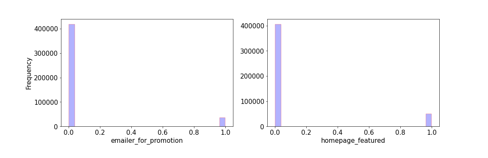
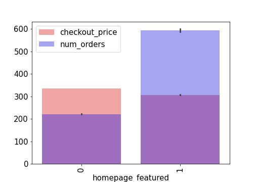
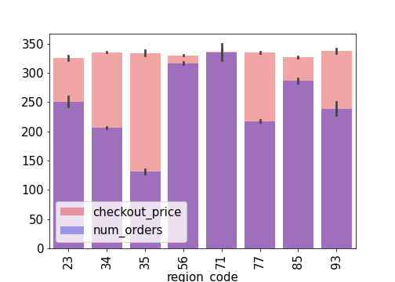
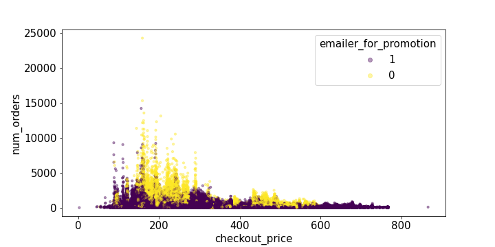

# A/B Testing for Meal Food Delivery 
## Table of contents
* [1. Introduction](#1-introduction)
* [2. Methodology and data](#2-methodology-and-data)
* [3. Exploratory data analysis (EDA)](#3-exploratory-data-analysis-EDA)
* [4. results](#4-results)
    - [4.1. ](#41-)
    - [4.2. ](#42-)
    - [4.3. ](#43-)
* [5. Conclusions](#4-conclusions) 
* [6. Setup](#5-setup)
* [Reference](#reference)

## 1. Introduction

## 2. data, Problem, Methodology
### 2.1 Data

 
Data has gotten from  https://www.kaggle.com/ghoshsaptarshi/av-genpact-hack-dec2018?select=train.csv. This data was part of Analytics Vidhya and Genpact's Machine Learning Hackathon work during Dec 15 2018 00:00 GMT+0530 to Dec 16 2018 23:59 GMT+0530. Based on the data, there is a meal delivery company in multiple cities for sending meal orders to its customers. Collections of data are done weekly. The dataset includes three dataframes: 
- fulfilmentcenterinfo.csv: 5 columns information contain 'center_id', 'city_code', 'region_code', 'center_type', and 'op_area' for each fulfillment center,  
- meal_info.csv: three columns information contain 'meal_id', 'category', and 'cuisine' for each meal being served,  
- order_via_price.csv: 9 columns information contains 'id', 'week', 'center_id', 'meal_id', 'checkout_price', 'base_price', 'emailer_for_promotion', 'homepage_featured', and 'num_orders' for orders and checkout price. 
As a result of a combination of three tables, there is a new table with 15 columns. In table 1 you can see all columns with a brief explanation of them. 

<table> {float:left}
    <caption><b>Table 1.</b> Introducing features and their Feature Explanation
  </caption> 
    <tr align="left"> <th>Fearture</th><th>Feature Explanation</th> </tr> 
    <td align="left">Id (AA)</td><td align="left">Unique ID</td></tr>
    <td align="left">week</td><td align="left">Week Number</td></tr>
    <td align="left">center_id</td><td align="left">Unique ID for fulfillment center</td></tr>
    <td align="left">meal_id</td><td align="left" >Unique ID for Meal</td></tr>
    <td align="left">checkout_price</td><td align="left">Final price including discount, taxes and delivery charges</td></tr>
    <td align="left">base_price</td><td align="left">Base price of the meal</td></tr>
    <td align="left">emailer_for_promotion</td><td align="left">Emailer sent for promotion of meal</td></tr>
    <td align="left">homepage_featured</td><td align="left">Meal featured at homepage</td></tr>
    <td align="left">num_orders</td><td align="left">Orders Count</td></tr>
    <td align="left">category</td><td align="left">Type of meal (beverages/snacks/soup/...)</td></tr>
    <td align="left">cuisine</td><td align="left">Meal cuisine (Indian/Italian/…)</td></tr>
    <td align="left">city_code</td><td align="left">Unique code for city</td></tr>
    <td align="left">region_code</td><td align="left">Unique code for region</td></tr>
    <td align="left">center_type</td><td align="left">Anonymized center type</td></tr>
    <td align="left">op_area</td><td align="left">Area of operation (in km^2)</td></tr>  
</table>

### 2.2  Problem

The preparation of raw materials is done weekly because the most  raw material is perishable. This is the biggest problem for the company. In order to solve this problem, first of all the procurement planning is of the most extreme importance. Secondly, the centers can also help to forecast accurate demands. The aim of this work is following information for evaluation which factors help to balance between supply and demand and increase number orders and sales. This evaluation is done by A/B testing approach based on data from week 1 to 145, meal features such as category, cuisine, checkout price and number orders, and information for fulfillment centers like center area and city information.
 

### 2.3 Methodology

For this work, A/B testing is a way to compare two versions of categories, cuisine, meal featured at homepage, emailer sent for promotion of meal and anonymized center type to figure out which performs better. While this method is not able to predict checkout price or number orders. This method is the simplest form of a randomized controlled experiment because you control the factors which you know about them but maybe there are other randomized factors that you do not know about. This testing method can help the food delivery company to realize which features in table 1 are more effective to increase, especially number orders, sales, and what is the most likely to make people order. For example there is data for Italian and Thai cuisines and then determining which influences our success features the most. Following these steps to do A/B testing:
    - Null hypothesis: the number of orders of Italian cuisine is the same as Thai one. 
    - Hypothesis: their number orders are not the same. 
    - set α significant level: for this case α=0.05. 
    - Calculate P-value: two sample t-test (Welch t test) and two sample u-test (Mann Whitney) methods.  
    - Comparison: If α is less than P-value: fail to reject null hypothesis; otherwise reject null hypathisit. 
 

## 3. Exploratory data analysis (EDA)

 
 This section is performed by some EDA to gain some insights about the data. The figure 2 shows histograms of features. Based on this figure, there are three types for center_type and type_A has more frequency. The distribution of op_eara shows the maximum frequency is at area of operation in 4 km^2. It is interesting, the checkout price has a large range between $100 to $800 with more or less a normal distribution. In contrast, num_orders is in a wide range (0,25000) with half normal distribution. There are four types of cuisines: Thai, Indian, Italian (with the largest frequency) and Continental (with the least frequency) cuisines. Beverages have a very high frequency. Unlike beverages, other types of category have approximately the same frequency. Emailer_for_promotion and homepage_featured have two types with similar distributions. For histogram of week, there is a regular alternative but you should be careful because this image just shows how many frequencies each week, not how many number orders of each week. 
 

      
 

    
    
     
    
    
    
    

  
<b>Figure 2.</b> Histograms of features of meal food delivery which is mentioned in table 1.

 
 The figure 3 shows pie plots of features versus number orders and checkout price. Based on this figure, the most percentage of number orders (popularity) are orders of Beverages and rice bowl and sandwich among categories and the most expensive categories are beverages, pizza and seafood. Number orders and checkout price via center_type behave similarly. Comparison number orders and checkout price based on cuisines give different information. However Italian cuisine has the highest order but Continental cuisine is the most expensive and it makes sense Continental cuisine has the lowest order. For emailer_for promotion, homepage_featured and region_code have the same correlation via number orders and checkout price. 
 

    
     
    
    
    
    

  
<b>Figure 3.</b> Pie plots of features of meal food delivery which is mentioned in table 1.

 
 The figure 4 shows bar plots of features versus number orders and checkout price. The EDA of this figure is like the figure 3. The figure 5 shows scatter plots of features versus number orders and checkout price. The EDA of this figure does not show specific things. 
 

    
     
    
    
    
    
    

  

<b>Figure 4.</b> bar plots of features of meal food delivery which is mentioned in table 1.

    
     
    
    
    
    
    
    
    
    

  

<b>Figure 5.</b> Scatter plots of features of meal food delivery which is mentioned in table 1.

 
 In the figure 6, average checkout_price goes up very slowly via week while the average number of orders has fluctuations around 300. There is interesting behaviour in the plot of average emailer_for_promotion. This plot shows sending a promotion email is alternative but it doesn't have a direct effect on increasing number orders. It can be a good consideration that  emailer_for_promotion has an effect on sales based on A/B testing. It can be defined for this problem for homepage_featured as well.   
 

    
     
    
    

  

<b>Figure 6.</b> Illustration of mean and standard deviation (std) of checkout_price, emailer_for_promotion, homepage_featured and num_orders via week.  

 
In the figure 7, total checkout_price and total checkout price per number orders go up via week while total number of orders is constant approximately. It makes sense that the price increases over time due to inflammation.  
 

    
     
    
    
    

  

<b>Figure 7.</b> Illustration of mean and standard deviation (std) of total checkout rpice in each week (sum_over_checkout_price), sum_over_emailer_for_promotion, sum_over_homepage_featured, sun_over_num_orders and total checkout price per number orders (sum_over_price_per_order) via week. 

## 4. results
### 4.1. 
### 4.2.
### 4.3. 
## 5. Conclusions

## 6. Setup
There are two folders in the repository: 
1- notebooks: contain all Jupyter notebook files  
2- src : contain all .py files  
All codes are written in Python 3.6.9  
To run this project you should run "main_code.py" in "src" folder or "main_code.ipynp" in "notebooks" folder. In "main_code.py" the following modules are imported with their tasks are conveyed in their names: 

* step_1_cleaning_data  
* step_2_convert_timecolumns_to_standard_time         
* step_3_choose_features_and_define_target  
* step_4_EDA_1  
* step_4_EDA_2 
* step_4_EDA_of_AA_OO_DL_WN_3   
* step_5_EDA_and_separate_airline_data 
* step_6_apply_ML_models_OO_airlines
 - step_6_1_divide_data_into_seen_and_unseen_files   
 - step_6_2_predict_categories_of_target  
 - step_6_3_predict_seen_target 
 - step_6_4_predic_unseen_target 
* step_6_apply_ML_models_AA_airlines 
 - step_6_1_divide_data_into_seen_and_unseen_files   
 - step_6_2_predict_categories_of_target  
 - step_6_3_predict_seen_target 
 - step_6_4_predic_unseen_target 
* step_6_apply_ML_models_DL_airlines
 - step_6_1_divide_data_into_seen_and_unseen_files   
 - step_6_2_predict_categories_of_target  
 - step_6_3_predict_seen_target 
 - step_6_4_predic_unseen_target 
* step_6_apply_ML_models_WN_airlines
 - step_6_1_divide_data_into_seen_and_unseen_files   
 - step_6_2_predict_categories_of_target  
 - step_6_3_predict_seen_target 
 - step_6_4_predic_unseen_target 

## Reference
[1] E. Mazareanu,“Global air traffic - number of flights 2004-2021”, Dec 2, 2020. (https://www.statista.com/statistics/564769/airline-industry-number-of-flights/#statisticContainer)  
[2] M. A. Makhloof, M. E. Waheed, U. A. Badawi, "Real-time aircraft turnaround operations manager", Production Planning & Control 25:1, pages 2-25, 2014. 
[3] https://www.azcentral.com  
[4] https://www.kaggle.com/usdot/flight-delays  
[5] https://www.transtats.bts.gov/OT_Delay/OT_DelayCause1.asp  
